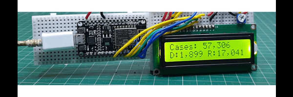

## Covid 19 Tracker using ESP8266
ESP8266 based device to integrate and show the real time data using covid 19 API. 
- 
- Tags: Category 1
- Badges:
  - Project [blue]
- Buttons:
  - Link [https://github.com/TauqeerAhmad5201/Covid-19-tracker]

## Text-Utility Application
An utility for customising the text.
- 
- Tags: Category 2
- Badges:
  - Project [blue]
- Buttons:
  - Link [https://github.com/TauqeerAhmad5201/react-textutils]

## Non Contact Thermometer
Arduino UNO based non contact thermometer to detect the temperature of a human body without any physical attention.
- 
- Tags: Category 3
- Badges:
  - Project [blue]
- Buttons:
  - Link [https://github.com/TauqeerAhmad5201/Non-Contact-Thermometer]